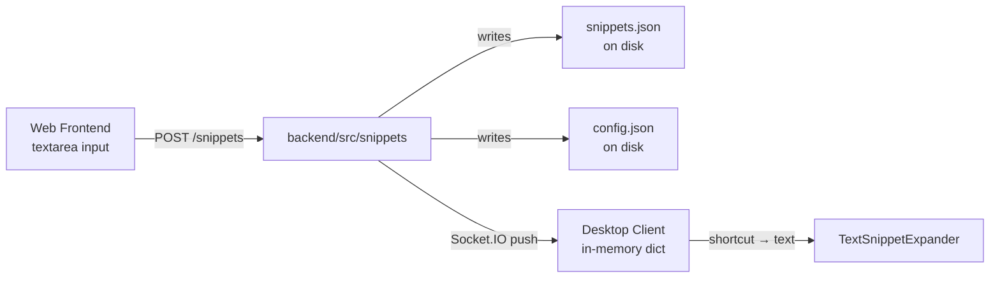
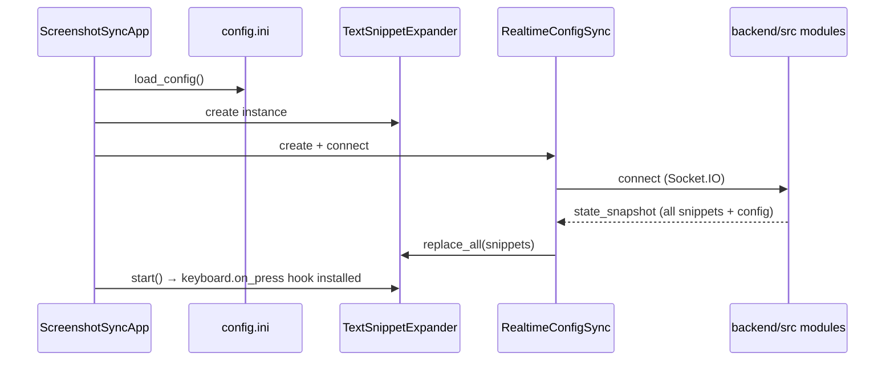
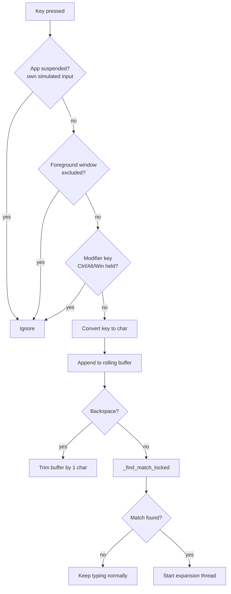
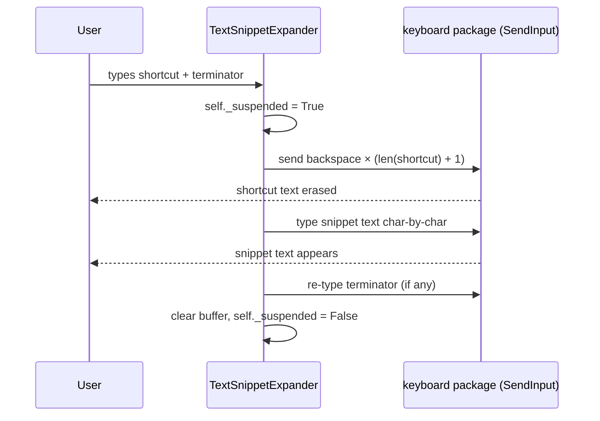
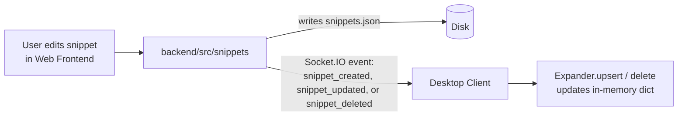
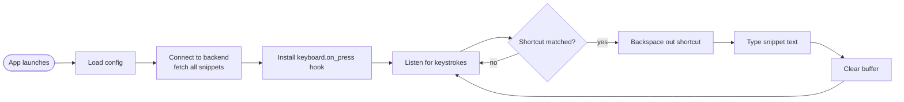

# Low-Level Design: Snippet Expander (Desktop Client)

A quick reference for how snippet expansion actually works in this app — from keystroke to inserted text.

> **Scope note:** This app currently supports **plain-text snippets only**. There is no clipboard use, no rich text, no forms/placeholders/formulas, and no per-app insertion strategy. Everything below reflects the real code, not planned features.

---

## 1. Components at a Glance

| Component | File | Role |
|---|---|---|
| `TextSnippetExpander` | `desktop-client/screenshot_client.py` | Listens to keystrokes, matches shortcuts, replaces text |
| `WindowsHotkeyListener` | `desktop-client/screenshot_client.py` | Separate hotkey system — **only for screenshots**, not snippets |
| `RealtimeConfigSync` | `desktop-client/screenshot_client.py` | Keeps snippet cache in sync with backend (Socket.IO) |
| `ScreenshotSyncApp` | `desktop-client/screenshot_client.py` | Main app — wires everything together on startup |
| Backend modules | `backend/src/snippets/`, `backend/src/appConfig/`, `backend/src/realtime.js` | Store snippets/config as JSON and push updates to the client |
| Web Frontend | `web-frontend/` | UI for creating/editing snippets |

---

## 2. Where Data Lives

- **Source of truth:** `snippets.json` on the backend (via `readSnippets()` / `writeSnippets()`).
- **Desktop client** does NOT read/write the JSON file directly — it only holds a synced **in-memory dictionary** (`self._snippets`) built from data pushed over Socket.IO.
- Local desktop settings (hotkey config etc.) live separately in `config.ini` under `AppData\Local\ScreenshotSync`.

**Why:** single source of truth on the backend + lightweight in-memory cache on the client = fast lookups without disk I/O on every keystroke.

---

## 3. Startup Flow

**Why this order:** the expander needs the full snippet list loaded **before** it starts listening, so the very first shortcut typed is already recognized.

---

## 4. Live Typing → Match Detection

Every keystroke goes through `_on_press()`. It's filtered step by step:

**Match rule (`_find_match_locked`):**
- Buffer must **end with** a known shortcut.
- Character before the shortcut must be a word boundary (or it's at buffer start).
- If a terminator (space, `.`, `,`, `!`, `?`, tab, newline) was just typed → expand immediately.
- If no terminator yet → only expand if the shortcut isn't a prefix of a longer shortcut (avoids expanding `/t` while user is still typing `/thanks`).

**Why:** prevents accidental mid-word triggers and avoids expanding a shorter shortcut before the user finishes typing a longer one.

---

## 5. Expansion (The Actual Replacement)

Once matched, `_expand()` runs on a background thread:

**Key facts:**
- **No clipboard involved at all.** This is 100% simulated keystrokes (`keyboard.send("backspace")`, `keyboard.write()`).
- `self._suspended` flag exists **so the app doesn't try to re-match its own simulated backspaces/typing** as new input — without it, expansion could trigger itself in a loop.
- Newlines/tabs inside a snippet are sent as real Enter/Tab key presses, not literal characters.

**Why keystroke-simulation instead of clipboard/UI Automation:** simplest approach that works generically across any focused text field, at the cost of no rich text support and no per-app handling.

---

## 6. Keeping Snippets Fresh (Live Sync)

- Changes made in the web UI are pushed live to any connected desktop client — no restart or manual refresh needed.
- The in-memory dictionary (not a trie — plain dict, sorted by key length at lookup time) is mutated directly, so new/edited shortcuts are usable immediately.

---

## 7. What's Explicitly NOT Implemented

So nobody assumes otherwise:

- ❌ Clipboard-based insertion / restoration
- ❌ Rich or styled text (bold, links, images) in snippets
- ❌ Forms, placeholders, formulas, conditional logic in snippets
- ❌ Per-target-app insertion strategy (browser vs. Word vs. contentEditable)
- ❌ Time-based delay/timeout on shortcut typing (only length-based buffer trimming)
- ❌ Undo integration or failed-insertion recovery

---

## 8. End-to-End Summary

